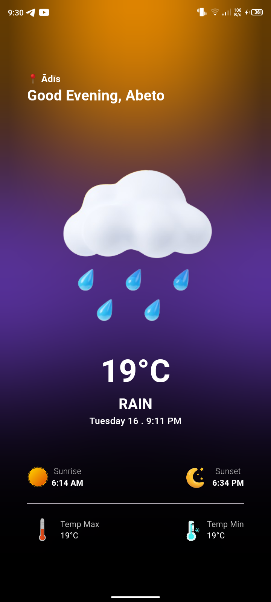
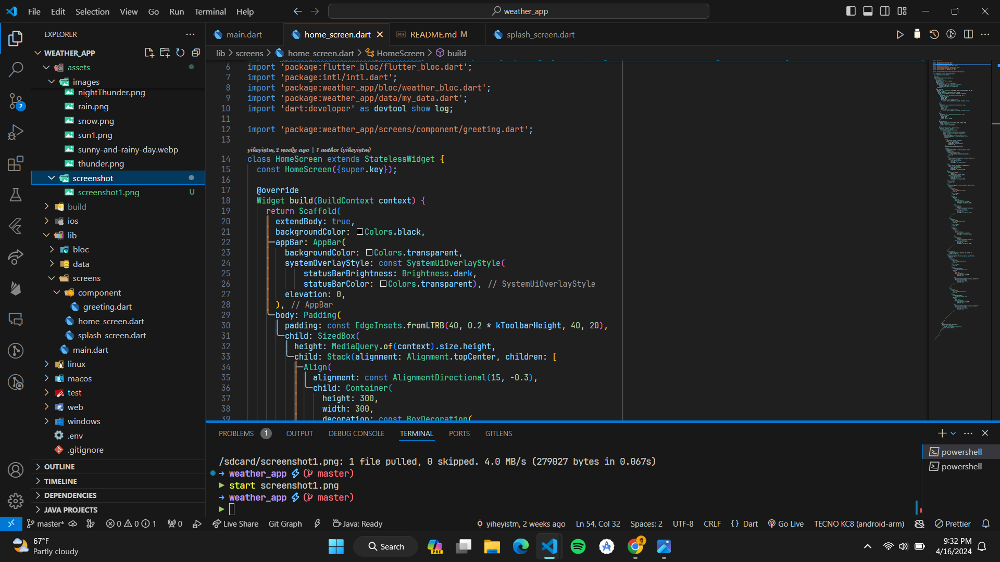

# Project Title

This is a weather application built with Dart and Flutter.

## Getting Started

These instructions will get you a copy of the project up and running on your local machine for development and testing purposes.

### Prerequisites

What things you need to install the software and how to install them:

- Flutter SDK
- Dart SDK
- An IDE like VS Code or Android Studio

### Installing

A step by step series of examples that tell you how to get a development environment running:

1. Clone the repository
2. Open the project in your preferred IDE
3. Run `flutter pub get` to install dependencies
4. Start your emulator
5. Run `flutter run` to start the app

## Built With

* [Flutter](https://flutter.dev/) - The web framework used
* [Dart](https://dart.dev/) - Language

## Authors

* **Your Name** - *Initial work* - [YourGithubUsername](https://github.com/YourGithubUsername)

